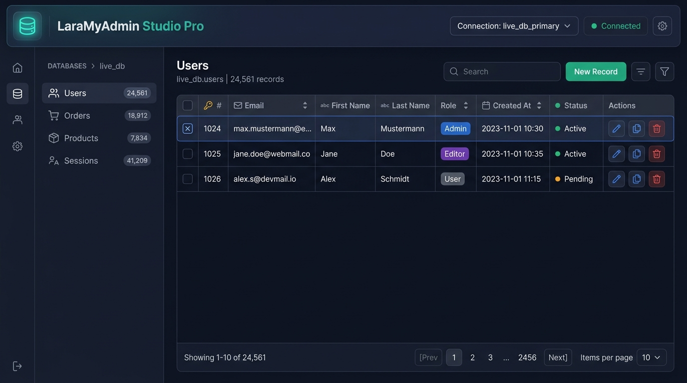

<p align="center">
  
</p>

# LaraMyAdmin ⚡ (Laravel Multi-Database Studio Pro)

A modern, powerful, and developer-friendly database management package for **Laravel** (a state-of-the-art alternative to phpMyAdmin, TablePlus, and Adminer).

Manage all your connected databases (MySQL, PostgreSQL, SQLite, SQL Server), dynamically connect to external databases, browse & edit data, design schemas, execute raw SQL queries, export code to Laravel migrations/models, generate mock data, search globally, and compare schemas right from a sleek, dark-mode web studio.

---

## ✨ Features

- **🌐 Multi-Database Connections**:
  - Auto-discovers all connections configured in Laravel (`config/database.php`).
  - Dynamic on-the-fly connections (MySQL, PostgreSQL, SQLite, SQL Server) with connection testing & ping.
  - One-click connection switcher in the header.

- **🚀 Laravel-Specific Superpowers**:
  - **Export to Migration**: 1-click generation of Laravel migration files (`create_xyz_table.php`).
  - **Export to Eloquent Model**: Generates PHP Eloquent Models with `$fillable`, `$casts`, and foreign key relationship methods (`hasMany`, `belongsTo`).
  - **Export to Model Factory**: Generates Laravel Model Factory definitions with Faker.

- **⚡ Spreadsheet-Style Inline Cell Editing**:
  - Double-click any cell in the data grid to edit the value directly in-place and press `Enter` to commit.

- **🔍 Global Database Search**:
  - Search any keyword across **all tables in the database at once**.

- **🤖 Mock Data Generator**:
  - 1-click seeding of 10, 25, 50, or 100 realistic dummy records matching table columns and types.

- **🗺️ Visual Schema & ER Diagram**:
  - Interactive diagram displaying tables, columns, row metrics, and relationship links.

- **⚖️ Schema Diff & Database Comparison**:
  - Compare two connected databases (e.g. `local` vs `staging`) to detect missing tables and mismatched column types.

- **💻 SQL Query Console & Bookmarks**:
  - Syntax-highlighted CodeMirror SQL editor with `Ctrl + Enter` execution.
  - Execution timer (ms) and affected rows counter.
  - `EXPLAIN` query performance analyzer.
  - Save favorite queries as **Bookmarks** with custom labels.

- **📦 Export & Import**:
  - Export tables to SQL Dump, CSV, or JSON.
  - Import SQL dump files or raw SQL statements.

- **🔒 Security & Permissions**:
  - Read-only mode protection.
  - Custom authorization callback (`LaraMyAdmin::auth(...)`).

---

## 🚀 Installation

Install LaraMyAdmin via Composer:

```bash
composer require humxmad/laramyadmin
```

Publish configuration (optional):

```bash
php artisan vendor:publish --tag=laramyadmin-config
```

Access LaraMyAdmin in your browser:
```
http://your-app.test/laramyadmin
```

---

## 🔐 Authorization Gate (Production Protection)

```php
use LaraMyAdmin\LaraMyAdmin;

public function boot(): void
{
    LaraMyAdmin::auth(function ($request) {
        return $request->user() && $request->user()->is_admin;
    });
}
```

---

## 🧪 Testing

```bash
composer test
```

---

## 📄 License

The MIT License (MIT). Please see [License File](LICENSE) for more information.
